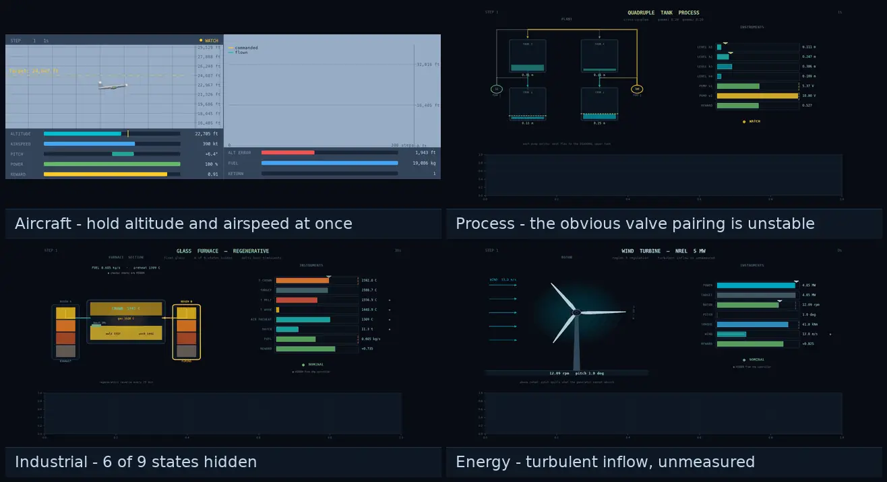

<h1 align="center">TargetGym</h1>

<p align="center">
  <b>Reach the target. Then hold it.</b><br/>
  21 JAX environments for setpoint tracking, with tuned PID and MPC baselines.
</p>

<p align="center">
  <a href="https://pypi.org/project/target-gym/"></a>
  <a href="https://pypi.org/project/target-gym/"></a>
  <a href="https://github.com/YannBerthelot/TargetGym/actions"></a>
  <a href="#license"></a>
  
  <a href="https://colab.research.google.com/github/YannBerthelot/TargetGym/blob/main/notebooks/quickstart.ipynb"></a>
</p>

<p align="center">
  <br/>
  <sub>One example task from each family, under PID control.</sub>
</p>

TargetGym provides reinforcement learning environments for **target MDPs**:
tasks where the objective is to reach a setpoint and hold it against
disturbances, rather than to reach a goal state once. The environments model
real plants, including an A320-like aircraft, a glass furnace, a nuclear
reactor, a cement kiln, a grid battery and a wind turbine.

- **Baselines included.** Every environment ships a tuned PID; 20 of 21 also
  ship an MPC with full state access, which serves as an upper bound. Both are
  recorded over ten seeds in `data/baseline_returns.json`.
- **Validated physics.** Each environment carries a `PHYSICS.md` with a sourced
  parameter table, published validation targets asserted by tests, and its
  documented approximations.
- **JAX throughout.** `jit`, `vmap` and `scan` compatible, end-to-end GPU,
  0.6 M to 700 M steps/s on CPU depending on the plant.
- **gymnax API**, with a Gymnasium wrapper for non-JAX libraries and a JaxMARL
  interface for the multi-agent patrol task.

Learned-policy results are not published yet. The measurement protocol is
defined in [docs/rl-protocol.md](docs/rl-protocol.md).

---

## Installation

```bash
pip install target-gym
```

## Quickstart

Also available as a [Colab notebook](https://colab.research.google.com/github/YannBerthelot/TargetGym/blob/main/notebooks/quickstart.ipynb).

```python
import jax
import numpy as np
from target_gym.provenance import load_recorded_baselines
from target_gym.registry import REGISTRY
from target_gym.runners.runners import baseline_policy

spec = REGISTRY["plane"]
env, params = spec.make_env(), spec.make_test_params()


def evaluate(policy, seed):
    key = jax.random.PRNGKey(seed)
    obs, state = env.reset_env(key, params)
    total = 0.0
    for _ in range(int(params.max_steps_in_episode)):
        action = policy(np.asarray(obs), state)
        obs, state, reward, terminated, _ = env.step_env(key, state, action, params)
        total += float(reward)
        if bool(terminated):
            break
    return total


print("PID:", evaluate(baseline_policy(spec, "pid", params), seed=0))

# MPC returns are pre-recorded on the same seeds, so re-running them is optional
# and costs minutes per seed.
print("MPC:", load_recorded_baselines()["plane"]["mpc_returns"][0])
```

Baselines and learned policies share the `(obs, state)` signature, so one
evaluation loop serves all three. The PID reads `obs` only, as a plant
controller does. The MPC reads `state`, including quantities the observation
withholds, which is what makes it an upper bound rather than a peer;
[docs/baselines.md](docs/baselines.md) quantifies the resulting advantage.

<details>
<summary>Non-JAX libraries, e.g. stable-baselines3</summary>

End-to-end GPU requires a JAX-based library.

```python
# doc: skip (trains for 10 000 steps; tests/plane/test_agent.py covers this path)
from target_gym import GymnasiumPlane
from stable_baselines3 import SAC

env = GymnasiumPlane()
model = SAC("MlpPolicy", env, verbose=1)
model.learn(total_timesteps=10_000, log_interval=4)

obs, info = env.reset()
while True:
    action, _states = model.predict(obs, deterministic=True)
    obs, reward, terminated, truncated, info = env.step(action)
    if terminated or truncated:
        break
```

</details>

Vectorised rollouts, the registry API, the patrol interface and the wind model
are covered in [docs/getting-started.md](docs/getting-started.md).

---

## Environments

| Family | Count | Environments |
|---|---|---|
| **Aircraft** | 9 | A320-like 2D aircraft on three reference patterns; four 3D path-following tasks; two formation-patrol variants |
| **Process control** | 5 | CSTR, first-order lag, four-tank, pH neutralisation, binary distillation |
| **Industrial / energy** | 5 | Glass furnace, nuclear reactor, building HVAC, boiler drum, cement kiln |
| **Renewable energy** | 2 | Wind turbine, grid battery |

**[Full environment reference →](docs/environments.md)** with observation and
action shapes, tracked variables, baseline returns and physics contracts.

The CSTR, first-order and four-tank models are adapted from
[PC-gym](https://github.com/MaximilianB2/pc-gym) and checked against its source
term by term, as each `PHYSICS.md` provenance line records.

The two patrol environments are multi-agent: wingmen hold a slot on a lead
flying its own route, so the reference is another aircraft and collision ends
the episode.

Environments span six difficulty tiers, graded on dynamics (linearity,
coupling, stiffness) and on the RL side (dimensionality, horizon, partial
observability), from a first-order lag at tier 1 to the cement kiln and the
multi-agent patrol at tier 6. See the
**[complexity ladder](docs/complexity.md)**.

Each environment renders a control-room dashboard: plant schematic, gauges with
limit and setpoint markers, strip charts, and explicit marking of quantities the
controller cannot measure. See the **[rendering guide](docs/rendering.md)**.

---

## Why setpoint tracking

Holding a setpoint indefinitely exposes failure modes that episodic goal-reaching
does not:

| | |
|---|---|
| **Irrecoverable states** | A drum that carries water into the turbine, a reactor past runaway, a kiln that has gone cold |
| **Deep partial observability** | The furnace hides 6 of 9 states, the reactor 7 of 11, the kiln 64 behind 8 measurements |
| **Inverse response** | Opening the steam valve makes drum level *rise* as water leaves; the four-tank's obvious loop pairing is unstable |
| **Transport delay** | Half the kiln's response to a fuel change takes a full 25-minute residence time |
| **Multi-timescale dynamics** | Millisecond neutronics against hour-long xenon; sub-second flame gas against 30-hour glass residence |
| **Finite budgets** | A battery spends charge to follow dispatch and then cannot follow it |

Also modelled: actuator lag, competing objectives, and scheduled setpoints that
reward anticipation (the building's night setback, the furnace's crown schedule,
the battery's dispatch blocks). Aircraft fly in steady wind, altitude shear and
Ornstein-Uhlenbeck turbulence, unobservable by default.

---

## Baselines

Every environment ships a tuned PID; 20 of 21 also ship an MPC. The exception is
`patrol_bearing_only`, which withholds the slot error a planner would read.

Controller structure is chosen per plant:

- **Boiler drum**: three-element control, so feedwater tracks measured steam
  flow and shrink-and-swell cannot mislead the level loop.
- **Cement kiln**: cascade, because integral action on a 25-minute-old
  measurement oscillates at the delay period.
- **Four-tank**: crossed loops, since the negative RGA element makes the
  diagonal pairing unstable.

Three MPC implementations are used: CasADi/IPOPT where a symbolic model exists,
gradient-based planning through the JAX dynamics elsewhere, and cross-entropy
sampling for the cement kiln. Solver convergence is recorded alongside every
result.

Each baseline must beat the best constant action on its environment, a
deliberately low bar that a mis-wired controller fails. Weak baselines are
documented as such on their environment page.

> **A PID losing on a task says something about that task, not about PID
> control.** These environments are selected for problems where anticipation
> pays. Where reacting to the reference and the disturbances is sufficient, a
> PID is optimal or close enough that the difference does not appear in a
> return. Two environments were corrected after measurement showed exactly
> this: a battery whose dispatch signal was so noisy that no controller could
> exceed 0.43 of the reward ceiling, and a patrol follower tracking a lead at
> one fixed turn rate, which a single feedforward term cancels.

**[docs/baselines.md](docs/baselines.md)** covers the MPC implementations,
tuning and caching, solver reporting and per-environment coverage.

---

## Physics validation

Each environment carries a `PHYSICS.md` stating what it models and where that
holds, a parameter table citing or deriving every constant (flagged
`TUNED - not sourced` when neither applies), the published numbers it must
reproduce, and its known deviations.

Tests assert consequences rather than formulas: ISA table values, L/D ratios,
thermal time constants, energy balances, equilibria. A test that recomputes the
implementation's own expression would pass on a wrong one.

All 21 environments are covered by fifteen contracts, since aircraft variants
share a plant. A shared conformance suite additionally checks determinism, PRNG
handling, `jit`/`vmap`/`scan` compatibility and numerical health over full
episodes.

**[docs/PHYSICS_METHODOLOGY.md](docs/PHYSICS_METHODOLOGY.md)** documents the
method and lists what each model is validated against.

---

## Documentation

| | |
|---|---|
| **[Getting started](docs/getting-started.md)** | Episodes, vectorised rollouts, the registry, Gymnasium |
| **[Target MDPs](docs/target-mdp.md)** | The formal setting |
| **[Environment reference](docs/environments.md)** | All 21: shapes, tracked variables, baselines, contracts |
| **[Public API](docs/api.md)** | Stable and provisional surface |
| **[Baselines](docs/baselines.md)** | PID and MPC controllers, tuning, solver reporting |
| **[RL protocol](docs/rl-protocol.md)** | Measuring a learned policy |
| **[Reward shaping](docs/reward-shaping.md)** | The tracking reward and why it has that shape |
| **[Complexity ladder](docs/complexity.md)** | Six tiers, for curriculum use |
| **[Rendering](docs/rendering.md)** | Dashboards, toolkits, regenerating media |
| **[Throughput](docs/performance.md)** | Steps per second per environment |
| **[Physics methodology](docs/PHYSICS_METHODOLOGY.md)** | Sourcing, validation, bounds |
| **[Model review checklist](docs/model-review-checklist.md)** | Thirteen checks for any plant model |
| **[Testing](docs/testing.md)** | Suite organisation |

Full index: **[docs/](docs/index.md)**.

---

## Related projects

- **[gymnax](https://github.com/RobertTLange/gymnax)**: the JAX environment API
  TargetGym implements.
- **[Gymnasium](https://github.com/Farama-Foundation/Gymnasium)**: supported
  through a wrapper for non-JAX libraries.
- **[PC-gym](https://github.com/MaximilianB2/pc-gym)**: process-control
  environments; source of the CSTR, first-order and four-tank models.
- **[safe-control-gym](https://github.com/utiasDSL/safe-control-gym)**: closest
  in intent, comparing classical control, MPC and RL on shared tasks. It covers
  more controllers, TargetGym covers more plants.
- **[JaxMARL](https://github.com/FLAIROX/JaxMARL)**: the multi-agent API the
  patrol formation task follows.

---

## Roadmap

Rewards, physics, baselines and the measurement protocol are settled.
Outstanding before 1.0: published learned-policy results and hosted
documentation. Known gaps are recorded rather than omitted.

**[Full roadmap →](docs/roadmap.md)**

## Contributing

Bug reports, new environments, improved baselines and physics corrections are
welcome.

```bash
git clone https://github.com/YannBerthelot/TargetGym.git
cd TargetGym
uv sync --group dev
make ci                # ruff, black --check, docs, fast tests
```

Further targets: `make test`, `make test-all`, `make figures`, `make videos`,
`make tuning`.

Adding an environment means registering an `EnvSpec`, which inherits every
shared check, and writing a `PHYSICS.md` sourcing its numbers.
**[CONTRIBUTING.md](CONTRIBUTING.md)** has the details.

---

## Citation

```bibtex
@misc{targetgym2025,
  title        = {TargetGym: Reinforcement Learning Environments for Target MDPs},
  author       = {Yann Berthelot},
  year         = {2025},
  url          = {https://github.com/YannBerthelot/TargetGym},
  note         = {Lightweight physics-based RL environments for aircraft, process control, and industrial systems}
}
```

## License

MIT.
